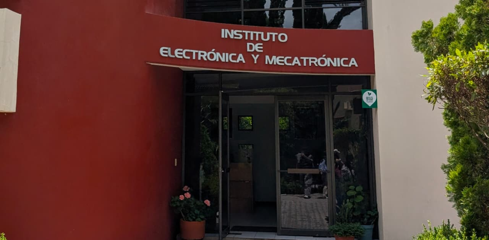

## Gianny Aram Alcántara Sánchez  :upside_down_face:

  

Estudiante de la carrera en Ingeniería en Mecatrónica ⚙️ en la Universidad Tecnológica de la Mixteca. En el año 2022 se graduó del Centro de Bachillerato Tecnológico Industrial y de Servicios #183 con una carrera técnica en Electricidad ⚡.

A lo largo de sus estudios universitarios ha utilizado diferentes softwares de diseño, electrónica analógica, electrónica digital y matemáticos 💻; como SolidWorks, Ansys Workbench,  Multisim, Proteus, Circuit Wizard, CircuitMaker, PSIM, LiveWire, Xilinx ISE, Arduino, Maple, MatLab, entre otros.

Posee habilidades que le permiten trabajar satisfactoriamente de forma colaborativa y de forma individual; como comunicación efectiva 🗣️, liderazgo 👨‍⚖️, capacidad de resolución de problemas 🛠️, cretividad 🎨 y pensamiento crítico 🧠.

#### **Redes sociales**:

